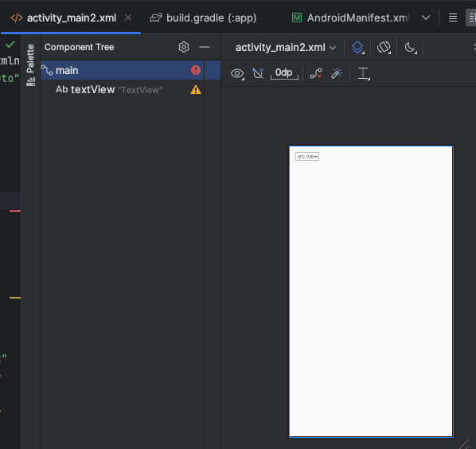

Added a second activity called MainActivity2 which automatically created xml and java-file
code and contents.
AndroidManifest.xml:
```
  <activity
            android:name=".MainActivity2"
            android:exported="false" />
```

MainActivity2.java includes many changed but this is the main one:
```
      @Override
    protected void onCreate(Bundle savedInstanceState) {
        super.onCreate(savedInstanceState);
        EdgeToEdge.enable(this);
        setContentView(R.layout.activity_main2);
        ViewCompat.setOnApplyWindowInsetsListener(findViewById(R.id.main), (v, insets) -> {
            Insets systemBars = insets.getInsets(WindowInsetsCompat.Type.systemBars());
            v.setPadding(systemBars.left, systemBars.top, systemBars.right, systemBars.bottom);
            return insets;
        });
```
Below is the xml-file for the second activity whcih was also simultaneously created:
```
<?xml version="1.0" encoding="utf-8"?>
<androidx.constraintlayout.widget.ConstraintLayout xmlns:android="http://schemas.android.com/apk/res/android"
    xmlns:app="http://schemas.android.com/apk/res-auto"
    xmlns:tools="http://schemas.android.com/tools"
    android:id="@+id/main"
    android:layout_width="match_parent"
    android:layout_height="match_parent"
    tools:context=".MainActivity2">

</androidx.constraintlayout.widget.ConstraintLayout>
```


Versions had to be changed to these in app/build.gradle because of errors making the app unable to run:
```
    implementation 'com.google.android.material:material:1.4.0'
    implementation 'androidx.activity:activity:1.1.0'
```

A button as added to te first MainActivity.java with intent to navigate to the second "Mainactivity2.java":
```
 Button activity2Button = findViewById(R.id.activity2);

        activity2Button.setOnClickListener(new View.OnClickListener() {
            @Override
            public void onClick(View v) {
                // Create Intent to start MainActivity2
                Intent intent = new Intent(MainActivity.this, MainActivity2.class);
                startActivity(intent);
            }
        });
```
A button was added to activity_main.xml to be pressed and brought to the second activity by the id:
```
 <Button

        android:layout_width="wrap_content"
        android:layout_height="wrap_content"
        android:text="hjgjhgjgjjg"
        android:text="Go to main activity 2"
        android:id="@+id/activity2"
        app:layout_constraintBottom_toBottomOf="parent"
        app:layout_constraintLeft_toLeftOf="parent"
        app:layout_constraintRight_toRightOf="parent"
```
Added the code for the intent to MainActivity.java:
```
public void onClick(View v) {
                // Create Intent to start MainActivity2
                Intent intent = new Intent(MainActivity.this, MainActivity2.class);
                startActivity(intent);
                
```

And changed the code to this in MainActivity2.java:
```
Bundle extras = getIntent().getExtras();
  int number = 500;

        // Log the number value (optional)
        Log.d("500", "Number: " + number + ", " + 500);


        TextView textView = findViewById(R.id.textView);


        textView.setText(String.valueOf(number));
    }
```

After these steps i did some cleaning of redundant code and struggled with adding the image
a bit. Then wrote this Readme-file.


Image of the complete second layout with data displayed in the top left corner sent with the intent:


